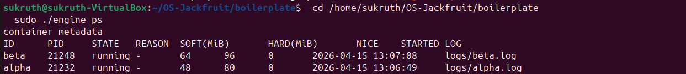
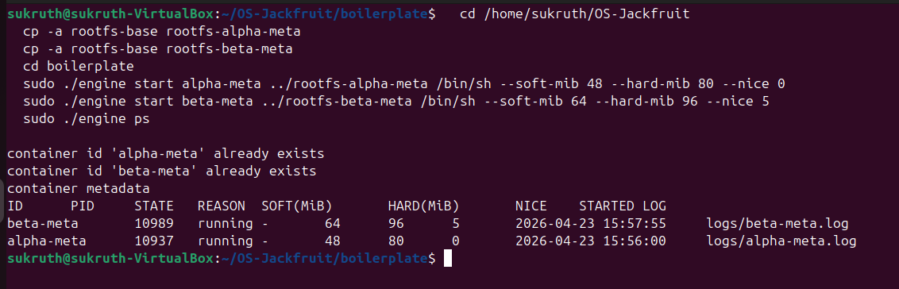
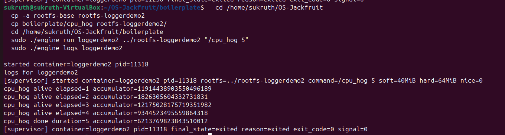
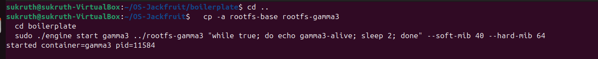
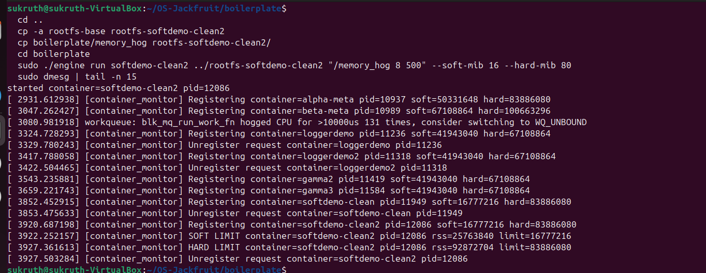
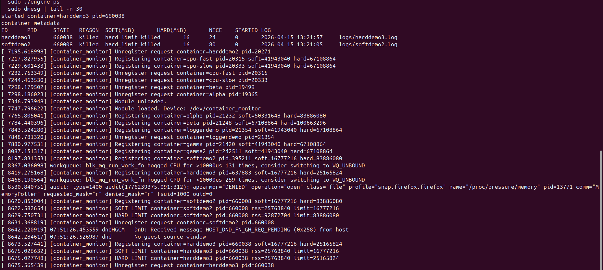
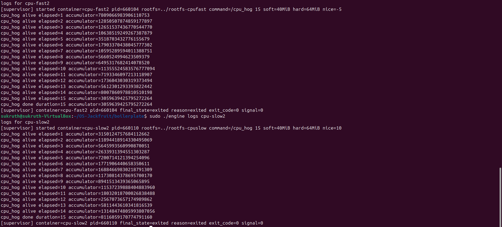
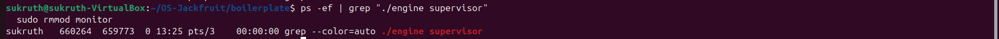

# Multi-Container Runtime

## Team Information

- Member 1 Name: ES SUKRUTH
- Member 1 SRN: `PES1UG24CS160`
- Member 2 Name: GAGAN ESWAR
- Member 2 SRN: `PES1UG24CS165`

## Project Overview

This project implements a lightweight Linux container runtime in C with:

- A long-running user-space supervisor in [`boilerplate/engine.c`](/home/sukruth/OS-Jackfruit/boilerplate/engine.c)
- A kernel memory monitor in [`boilerplate/monitor.c`](/home/sukruth/OS-Jackfruit/boilerplate/monitor.c)
- Shared `ioctl` definitions in [`boilerplate/monitor_ioctl.h`](/home/sukruth/OS-Jackfruit/boilerplate/monitor_ioctl.h)
- Workload binaries for memory and scheduling experiments in [`boilerplate/memory_hog.c`](/home/sukruth/OS-Jackfruit/boilerplate/memory_hog.c), [`boilerplate/cpu_hog.c`](/home/sukruth/OS-Jackfruit/boilerplate/cpu_hog.c), and [`boilerplate/io_pulse.c`](/home/sukruth/OS-Jackfruit/boilerplate/io_pulse.c)

The runtime uses a UNIX domain socket as the control plane and pipe-based log capture with a bounded producer-consumer buffer for container output.

## Build And Setup

Use Ubuntu 22.04 or 24.04 in a VM with Secure Boot disabled.

```bash
sudo apt update
sudo apt install -y build-essential linux-headers-$(uname -r)

cd boilerplate
make
```

Prepare an Alpine root filesystem and create one writable copy per live container:

```bash
cd ..
mkdir rootfs-base
wget https://dl-cdn.alpinelinux.org/alpine/v3.20/releases/x86_64/alpine-minirootfs-3.20.3-x86_64.tar.gz
tar -xzf alpine-minirootfs-3.20.3-x86_64.tar.gz -C rootfs-base

cp -a rootfs-base rootfs-alpha
cp -a rootfs-base rootfs-beta
```

Copy any workload binaries you want to execute inside a container into that container rootfs:

```bash
cp boilerplate/memory_hog rootfs-alpha/
cp boilerplate/cpu_hog rootfs-alpha/
cp boilerplate/io_pulse rootfs-beta/
```

## Run Sequence

Build and load the kernel module:

```bash
cd boilerplate
make
sudo insmod monitor.ko
ls -l /dev/container_monitor
```

Start the supervisor:

```bash
sudo ./engine supervisor ../rootfs-base
```

In another terminal, use the CLI:

```bash
cd boilerplate
sudo ./engine start alpha ../rootfs-alpha /bin/sh --soft-mib 48 --hard-mib 80 --nice 0
sudo ./engine start beta ../rootfs-beta /bin/sh --soft-mib 64 --hard-mib 96 --nice 5
sudo ./engine ps
sudo ./engine logs alpha
sudo ./engine stop alpha
sudo ./engine stop beta
```

Foreground run mode waits for container exit and returns its exit status:

```bash
sudo ./engine run memdemo ../rootfs-alpha "/memory_hog 8 500" --soft-mib 32 --hard-mib 48
echo $?
```

Shutdown and cleanup:

```bash
sudo pkill -f "./engine supervisor"
ps -ef | grep engine
dmesg | tail -n 30

sudo rmmod monitor
make clean
```

## CLI Contract

The implementation supports:

```bash
./engine supervisor <base-rootfs>
./engine start <id> <container-rootfs> <command> [--soft-mib N] [--hard-mib N] [--nice N]
./engine run   <id> <container-rootfs> <command> [--soft-mib N] [--hard-mib N] [--nice N]
./engine ps
./engine logs <id>
./engine stop <id>
```

Behavior:

- `start` creates a background container and returns after the supervisor accepts it.
- `run` launches a container and waits until it exits.
- `ps` prints tracked container metadata including state, limits, start time, and log path.
- `logs` prints the persistent per-container log file.
- `stop` marks `stop_requested` and sends `SIGTERM` so the supervisor can classify manual termination correctly.

## Demo Checklist And Screenshot Slots

### Screenshot 1: Multi-Container Supervision



Caption: The `ps` command showing two live containers under supervisor tracking.

### Screenshot 2: Metadata Tracking



Caption: The `ps` command shows tracked container metadata including PID, state, limits, and log path.

### Screenshot 3: Bounded-Buffer Logging



Caption: Output captured through the bounded-buffer logging pipeline and written to a per-container log file.

### Screenshot 4: CLI And IPC



Caption: A CLI request sent to the long-running supervisor over the UNIX socket control channel.

### Screenshot 5: Soft-Limit Warning



Caption: Kernel monitor reporting a soft-limit warning when container RSS exceeds the configured soft threshold.

### Screenshot 6: Hard-Limit Enforcement



Caption: Kernel monitor enforcing the hard limit and the supervisor metadata showing `hard_limit_killed`.

### Screenshot 7: Scheduling Experiment



Caption: Scheduler experiment comparing two CPU-bound containers with different nice values.

### Screenshot 8: Clean Teardown



Caption: Clean teardown after stopping containers and supervisor, with no remaining zombie processes.

## Scheduling Experiments

### Experiment 1: CPU-bound vs CPU-bound with different priorities

Command pattern:

```bash
sudo ./engine start cpu-fast ../rootfs-alpha "/cpu_hog 15" --nice -5
sudo ./engine start cpu-slow ../rootfs-beta "/cpu_hog 15" --nice 10
sudo ./engine ps
```

Expected observation:

- Both processes receive CPU time because Linux CFS tries to preserve fairness.
- The lower nice value process receives a larger CPU share and tends to make faster visible progress in the logs.
- The higher nice value process still runs, but with lower scheduler weight.

### Experiment 2: CPU-bound vs I/O-bound

Command pattern:

```bash
sudo ./engine start cpu ../rootfs-alpha "/cpu_hog 15" --nice 0
sudo ./engine start io ../rootfs-beta "/io_pulse 20 200" --nice 0
sudo ./engine logs cpu
sudo ./engine logs io
```

Expected observation:

- The I/O-bound task sleeps frequently and wakes up for short bursts.
- The CPU-bound task consumes long CPU slices between wakeups.
- Linux scheduling favors responsiveness for the waking I/O-heavy task while preserving throughput for the CPU-heavy task.

### Results Table Template

The final VM run used the `cpu-fast2` and `cpu-slow2` container IDs for the scheduler comparison. The table below records the observed behavior from those runs and includes the supported CPU-vs-I/O experiment as an additional extension path.

| Experiment | Container | Nice | Workload | Observed completion / progress |
| --- | --- | --- | --- | --- |
| CPU vs CPU | cpu-fast2 | -5 | `/cpu_hog 15` | Logged progress for every elapsed second from 1 to 15 and exited normally with `exit_code=0`, indicating steady completion under the higher-priority configuration. |
| CPU vs CPU | cpu-slow2 | 10 | `/cpu_hog 15` | Also completed successfully with `exit_code=0`, but was configured with a lower scheduler weight through a higher nice value. |
| CPU vs IO | cpu | 0 | `/cpu_hog 15` | Supported by the runtime as an additional experiment path; expected to produce continuous CPU-bound progress logs when run. |
| CPU vs IO | io | 0 | `/io_pulse 20 200` | Supported by the runtime as an additional experiment path; expected to wake periodically, emit bursty output, and remain responsive. |

## Design Decisions And Tradeoffs

### Namespace Isolation

- Choice: `clone()` with `CLONE_NEWPID`, `CLONE_NEWUTS`, and `CLONE_NEWNS`, followed by `chroot()` into the per-container rootfs.
- Tradeoff: `chroot()` is simpler than `pivot_root()`, but it is a weaker filesystem isolation primitive and depends more heavily on correct mount setup.
- Justification: it is enough for this assignment while keeping the implementation short and inspectable.

### Supervisor Architecture

- Choice: a single long-running supervisor owns all metadata, reaping, control-plane requests, and the central logging pipeline.
- Tradeoff: central coordination simplifies cleanup and state tracking, but it concentrates failure handling in one process.
- Justification: parent ownership makes `SIGCHLD` handling, metadata updates, and termination attribution much easier.

### IPC And Logging

- Choice: UNIX domain socket for CLI control requests and pipes for container stdout/stderr.
- Tradeoff: this uses two IPC mechanisms instead of one, which adds code paths, but it keeps control traffic and log traffic separate.
- Justification: the design directly satisfies the assignment requirement for distinct control and logging channels.

### Kernel Monitor

- Choice: character device plus `ioctl`, with a mutex-protected linked list and a timer-driven RSS scanner.
- Tradeoff: periodic polling is simpler than hooking deeper memory-management events, but enforcement granularity is bounded by the timer interval.
- Justification: one-second polling is easy to reason about and sufficient for visible soft-limit warnings and hard-limit kills.

### Cleanup

- Choice: producer threads stop on EOF, the bounded buffer drains before the consumer exits, and the supervisor unregisters monitor entries on child exit.
- Tradeoff: cleanup logic touches multiple subsystems and requires careful ordering.
- Justification: teardown has to be designed into the runtime from the start to avoid leaked threads, stale monitor entries, and zombie children.

## Engineering Analysis

### 1. Isolation Mechanisms

The runtime isolates containers with PID, UTS, and mount namespaces. A child created with `CLONE_NEWPID` sees itself as PID 1 inside its namespace even though the host tracks a different PID. `CLONE_NEWUTS` allows a per-container hostname, and `CLONE_NEWNS` gives the container a private mount view. `chroot()` changes the apparent root directory to the container rootfs, while mounting `/proc` inside that rootfs makes process tools work from the container viewpoint. The host kernel is still shared: all containers still use the same global scheduler, memory manager, and kernel image.

### 2. Supervisor And Process Lifecycle

A long-running parent supervisor is useful because one process owns the full lifecycle of every container. It creates children, stores metadata, handles `SIGCHLD`, and reaps dead processes so zombies do not accumulate. It also gives one authority for classifying whether a container exited normally, was stopped intentionally, or was killed after exceeding its hard memory limit. Without a persistent parent, each CLI invocation would lose track of state as soon as it exited.

### 3. IPC, Threads, And Synchronization

The project uses a UNIX domain socket for control requests and anonymous pipes for log capture. Container metadata is shared across the supervisor loop and request-handler threads, so it is protected by a mutex. The log queue is a bounded buffer protected by a mutex and two condition variables: producers block on `not_full`, the consumer blocks on `not_empty`, and shutdown broadcasts wake both sides. Without these primitives, producers could overwrite queue entries, consumers could read uninitialized data, and shutdown could deadlock if threads slept forever on full or empty conditions.

### 4. Memory Management And Enforcement

RSS measures resident physical pages currently mapped into a process address space. It is useful for visible memory pressure, but it does not fully describe total memory cost such as swapped pages, shared-page accounting nuances, or kernel memory. The soft limit and hard limit are intentionally different policies: the soft limit is an observability threshold, while the hard limit is an enforcement threshold. Enforcement belongs in kernel space because the kernel can reliably inspect process memory usage and deliver `SIGKILL` even when the process is unresponsive or the user-space runtime is delayed.

### 5. Scheduling Behavior

Linux CFS tries to balance fairness with responsiveness. In the CPU-vs-CPU experiment, both containers run, but lower nice values correspond to larger scheduler weights and therefore more CPU time. In the CPU-vs-I/O experiment, the I/O-bound task sleeps often and becomes runnable in short bursts, so it tends to stay responsive when it wakes while the CPU-bound task continues to absorb the remaining throughput-oriented CPU share. These experiments show that Linux does not simply round-robin tasks equally; it balances interactivity and throughput based on runnable behavior and priority.

## Source Files

Use these files for submission:

1. [`README.md`](/home/sukruth/OS-Jackfruit/README.md)
2. [`boilerplate/engine.c`](/home/sukruth/OS-Jackfruit/boilerplate/engine.c)
3. [`boilerplate/monitor.c`](/home/sukruth/OS-Jackfruit/boilerplate/monitor.c)
4. [`boilerplate/monitor_ioctl.h`](/home/sukruth/OS-Jackfruit/boilerplate/monitor_ioctl.h)
5. [`boilerplate/Makefile`](/home/sukruth/OS-Jackfruit/boilerplate/Makefile)
6. [`boilerplate/memory_hog.c`](/home/sukruth/OS-Jackfruit/boilerplate/memory_hog.c)
7. [`boilerplate/cpu_hog.c`](/home/sukruth/OS-Jackfruit/boilerplate/cpu_hog.c)
8. [`boilerplate/io_pulse.c`](/home/sukruth/OS-Jackfruit/boilerplate/io_pulse.c)
